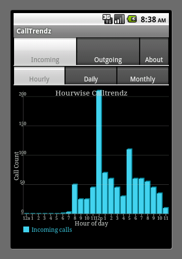
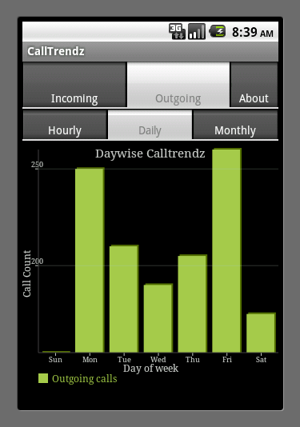

CallTrendz
==========

My first android app, written when android 2.3 was released. Helps track the trends of incoming/outgoing calls w.r.t time

Screenshots 

 

App Description -

Ever wondered what is the day of week when you use your phone most? Ever wondered
what hour of day you receive maximum number of calls? InterestingÎíÎõ huuuf.. but who
will tell you all this ?
Calltrendz! Calltrendz helps you to understand your phone usage patterns. Calltrendz
observes all your incoming and outgoing calls and presents you with very meaningful
and simple graphs showing your phone usage. Looking at the graph you can immediately
know the things such as what is the hour of day when you have received maximum number
of calls

Well... sounds great.. but whats the use of this information ?

1. Tune your mobile subscription plans and save $$
2. Predict if you are likely to get many calls in certain time period and may be put your
phone in silent mode if you dont want to get disturbed in that timeslot.

